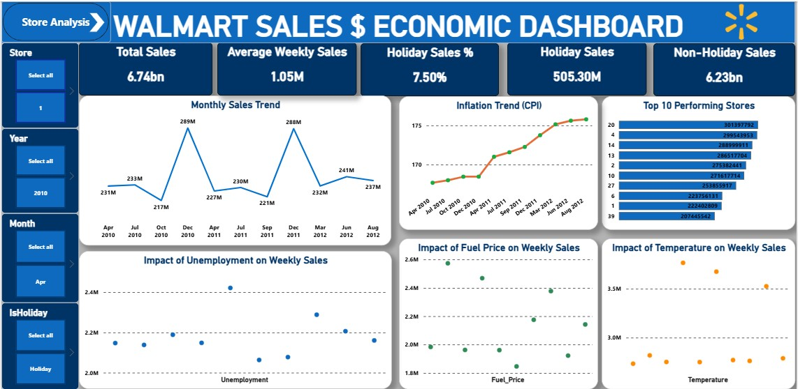
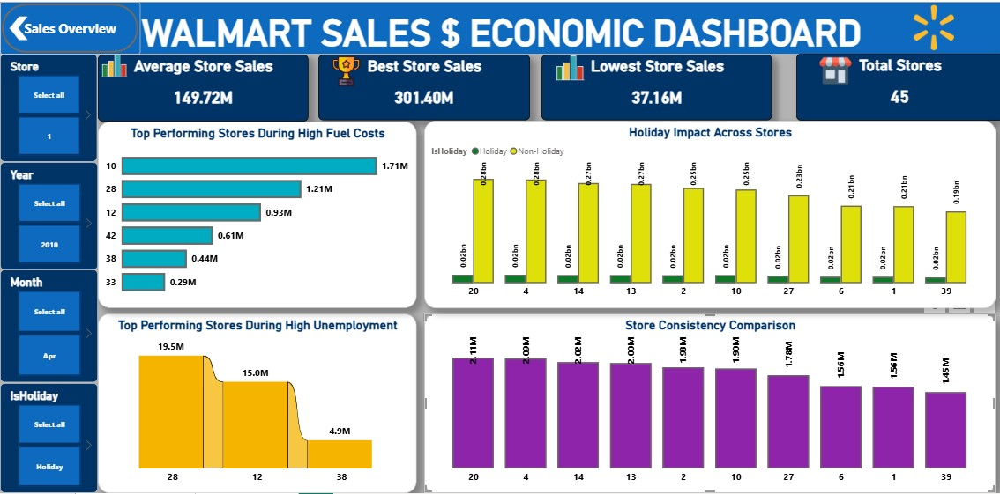

# Walmart Sales & Economic Impact Analysis

**An Interactive Power BI Dashboard exploring sales performance across 45 Walmart stores (Feb 2010 – Oct 2012), and how holidays, weather, fuel prices, unemployment, and inflation shape weekly demand.**

---

## Project Overview

Walmart wants to predict sales and demand accurately, but unforeseen swings in demand driven by holidays, markdown events, and macroeconomic conditions make this difficult. This project analyzes **weekly sales data across 45 stores** alongside four economic indicators (CPI, unemployment, fuel price, temperature) to answer one core business question:

> **What actually drives Walmart's weekly sales — and what doesn't?**

The dashboard is built around two connected views:

- **Sales Overview** — company-wide KPIs, store-level performance benchmarks, and holiday impact
- **Store Analysis** — time trends, top performers, and the relationship between sales and economic variables

A supporting correlation analysis quantifies the strength of each economic relationship.

---

## Dashboard Preview

### Sales Overview

### Store Analysis

---

## Key Metrics at a Glance

*Verified directly against the raw 6,435-row dataset (45 stores × Feb 2010 – Oct 2012) and the cleaned workbook's pivot/correlation sheets — all figures below match the dashboard exactly.*

| Metric | Value |
|---|---|
| Total Sales | **$6.74bn** |
| Average Weekly Sales | **$1.05M** |
| Holiday Sales | **$505.30M** |
| Non-Holiday Sales | **$6.23bn** |
| Holiday Sales Share | **7.50%** |
| Total Stores | **45** |
| Average Store Sales | **$149.72M** |
| Best Performing Store | **Store 20 — $301.40M** |
| Lowest Performing Store | **Store 33 — $37.16M** |
| Performance Gap (Best vs Worst) | **~8.1x** |
| Highest Single-Week Sales | **Store 14, week of Dec 24 2010 — $3.82M** |

---
  
## Methodology

- **Data:** Weekly sales data for 45 Walmart stores (Feb 2010 – Oct 2012; 6,435 store-weeks), paired with weekly CPI, unemployment rate, fuel price, and temperature. Source: [Kaggle — Walmart Dataset](https://www.kaggle.com/datasets/yasserh/walmart-dataset).
- **Tools Used:**
  - **SQL** for exploratory querying — holiday vs. regular week averages, store rankings, monthly/yearly trends, CPI and unemployment stratification (see `Walmart_Query.sql`)
  - **Power BI** for dashboarding (Sales Overview + Store Analysis pages with cross-filtering by Store, Year, Month, and Holiday flag)
  - **Excel** for the correlation analysis (Pearson correlation between weekly sales and each economic variable), cross-verified here against the raw data.

---

## Insights

### 1. Holidays punch far above their weight
Holiday weeks generate **7.50% of total revenue** despite making up only **450 of 6,435 weeks** in the dataset (~7%). On a per-week basis, the average holiday week brings in **$1.12M vs. $1.04M** for a regular week, a **7.8% uplift**. That's a real, verified effect (not dashboard rounding), and it lines up with the original brief's instruction to weight holiday weeks roughly 5x in evaluation: holiday weeks aren't just *more frequent revenue events*, each one individually outsells a typical week. **The single highest-selling week in the entire dataset was the week of Dec 24, 2010 led by Store 14 at $3.82M, nearly 4x that store's typical week.** Demand forecasting and inventory planning should be holiday-first, not economy-first.

### 2. Store identity matters more than the economy
The spread between the best store (Store 20, $301.40M) and the lowest (**Store 33, $37.16M**) is **over 8x**, a gap far larger than anything explained by unemployment, fuel prices, or weather. **Store 20 leads on total and average sales** ($2.11M average week vs. Store 33's $260K). But it's worth distinguishing "biggest" from "steadiest": when measured by coefficient of variation (how much a store's sales swing around its own average), **Store 20 is not the most stable**. Stores like **37, 30, and 43** swing the least relative to their size, while **35, 7, and 15** are the most volatile. So the picture has two separate layers: store *scale* (which Store 20 dominates) and store *stability* (which smaller, steadier stores actually win). Either way, this points to store-level factors: location, format, local demographics as the dominant driver of sales variance, not macroeconomic conditions.

### 3. Classic "economic headwinds" barely move the needle
The correlation analysis is the most important and most counter-intuitive finding in this project. Recomputed directly from the 6,435-row dataset, the values match the workbook's Correlation Analysis sheet exactly:

| Variable Compared | Correlation | Interpretation |
|---|---|---|
| Weekly Sales vs Temperature | −0.0638 | Weak relationship |
| Weekly Sales vs Fuel Price | 0.0095 | Almost no correlation |
| Weekly Sales vs Unemployment | −0.1062 | Very weak relationship |
| Weekly Sales vs CPI | −0.0726 | Weak relationship |

All four sit close to zero. **Rising fuel prices, unemployment, inflation, and seasonal temperature swings have, at most, a marginal direct effect on weekly sales at the aggregate level.** The high/low split confirms it at a coarser grain too: weeks with above-average unemployment average **$1.00M** in sales vs. **$1.09M** for below-average weeks; a real but small gap (~8%), nowhere near the holiday effect. This is a critical finding for the original business problem: a forecasting model that leans heavily on these macro indicators as primary predictors is unlikely to meaningfully improve accuracy. The scatter plots in the Store Analysis view visually confirm this. Sales cluster in a wide band regardless of unemployment, fuel price, or temperature level, with no discernible linear trend.

**Implication:** the inputs the business intuitively suspects (the economy, weather, gas prices) are not the lever. Forecasting effort is better spent on **holiday calendars, markdown timing, and store-specific baselines** than on macroeconomic indicators.

### 4. Inflation (CPI) has crept up steadily, without dragging sales down
CPI rose steadily across the dataset: **168.10 (2010) → 171.55 (2011) → 175.50 (2012)**. Despite sustained inflation, **total sales kept growing**, including new peaks in Dec 2010 and Dec 2011. This suggests Walmart's value positioning may make it relatively resilient to inflationary pressure, consistent with its reputation as a low-price retailer that benefits when consumers trade down.

### 5. Sales are highly seasonal, with December as the clear peak
The data runs **Feb 2010 through Oct 2012**. The Monthly Sales Trend shows a repeating pattern: steady mid-$200M months, then a sharp spike every December (**$288.8M in Dec 2010, $288.1M in Dec 2011**) before dropping sharply in January. This is a clean, repeatable seasonal signal.

### 6. "Top store" rankings depend entirely on which stress test you run
- **Overall top performer (total & average sales):** Store 20
- **Top performer during high fuel costs:** Store 10
- **At the single highest unemployment reading in the dataset (14.31%):** Store 28 led with $19.47M, followed by Store 12 ($14.96M) and Store 38 ($4.88M)
- **Highest single-week sales ever recorded:** Store 14 (Dec 24, 2010)
- **Steadiest performer relative to its own size:** Store 37

No single store wins every cut. Store 20 is the dominant performer by scale, but smaller stores like 28 and 10 lead under specific stress conditions, and Store 37 nowhere near the top by revenue, is actually the most internally consistent. This is a strong candidate for follow-up segmentation: clustering stores by sensitivity profile and stability, not just ranking them by total revenue.

 ---
 
## Recommendations

1. **Prioritize holiday-aware forecasting.** Holiday weeks sell ~7.8% higher on average and include the single highest-grossing week in the dataset. Build separate demand models (or at least separate uplift factors) for the four major holidays rather than relying on one time-series model for all 52 weeks.
2. **De-prioritize macroeconomic indicators as primary features.** CPI, unemployment, fuel price, and temperature all add minimal predictive value in isolation (|r| ≤ 0.11 across the board). They may still be worth including as minor secondary features, but shouldn't anchor the model.
3. **Investigate the Store 20 vs. Store 33 gap directly.** An 8x spread between best and worst stores is a bigger opportunity than economic modeling operational audits of underperforming stores could yield faster wins than further macro analysis.
4. **Separate "biggest" from "steadiest" when ranking stores.** Store 20 wins on scale; Store 37 wins on consistency. A single leaderboard hides this, segment stores by both revenue tier and volatility before making decisions about which stores to study or replicate.
5. **Use December as a stocking blueprint.** The repeatable, sharp December peak (and January drop-off) should directly inform inventory build-up and wind-down schedules particularly, given that the single biggest sales week on record was the week before Christmas 2010.

 
